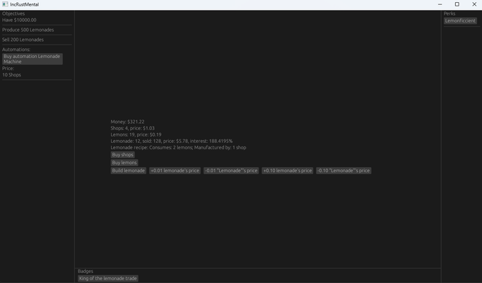

# Incrustmental

An simple, feature-poor library for creating incremental games with rust, inspired by the [Universal Paperclips](https://www.decisionproblem.com/paperclips/) game.

## Description

Incrustmental is a simple library that reads from an YAML file a creates a `State` objects that holds the information for the whole gameplay.

It defines a set of predefined objects like a `Product` and a `Product Material` such that the user wants to build and sell products which use materials which on must be bought with money. Thus the games that are defined with this library will be somewhat rigid, unless the it is being extended.

One would also need to define their own UI or use the one provided in the bevy example, which uses egui and is rather simple and ugly.

## Usage

In order to create a game all you need is to define an YAML(or JSON) file defining all the objects in the game and the relationships between them. Also you can define the state entirely programmatically if that's your cup of tea.

Incrustmental defines these types of objects:

* Product - A thing we construct during gameplay. Can be used as a building material of other products as well.
* Money - Used for construction of a product or buying a material.
* Product materials - Represents a material that can only be bought with money and be used for construction of a product.
* Badges - Simply a badge (represented by a name and a description) that can be won on certain condition(f.e you amassed X amount of money and sold N amount of a product). Used as a story building device.
* Perks - Modifiers applied to the build dependencies of a product. F.e if a lemonade is made from 10 lemons the perk may lower that number by a factor of 5. Just like the badges they are unlocked when a certain condition is met, but also have to be bought in order to take effect.
* Automations - These objects automate the construction of a product or the buying of a material. Just like perks they are unlocked on a certain condition and must be bought to take effect. They can be paused, since one may want to save up on money or materials in order to meet a certain condition.

In the `res` folder one can find the definition of a simple game via YAML where you are running a lemonstand. All of the fields are heavily documented so one can easily modify it, but a certain YAML knowledge is needed. There is also a JSON equivalent generated via `serde_json` and a programmatically defined game-state inside the bevy example.

## Examples

You can try out the library in action via the given `Lemonstand` example:

```
cargo run --release --example bevy
```

Screenshot:



## TODOs

- [ ] Ability to write custom defined formulas for materials' prices and products' interests.
- [ ] Editor with egui UI for creating the game state, instead of manual writing the yaml/json files.